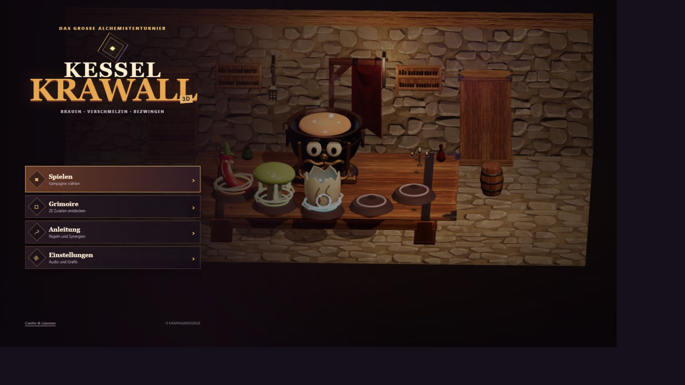
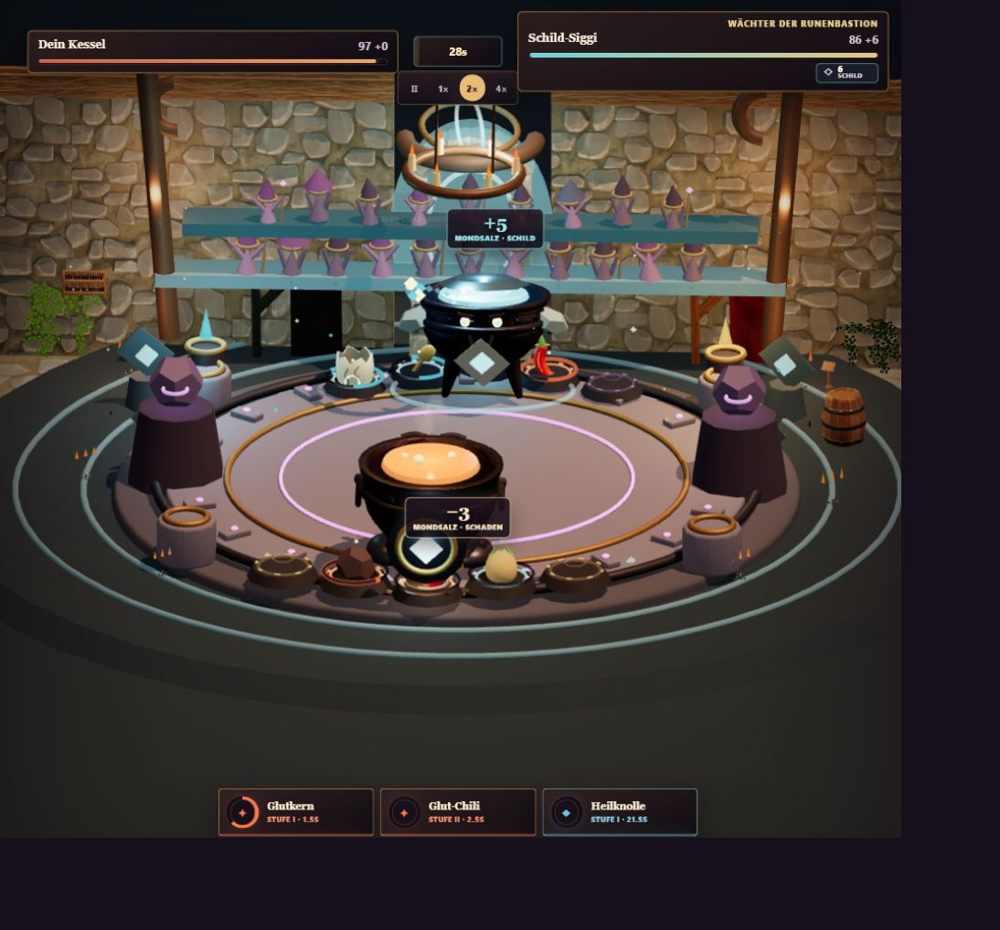
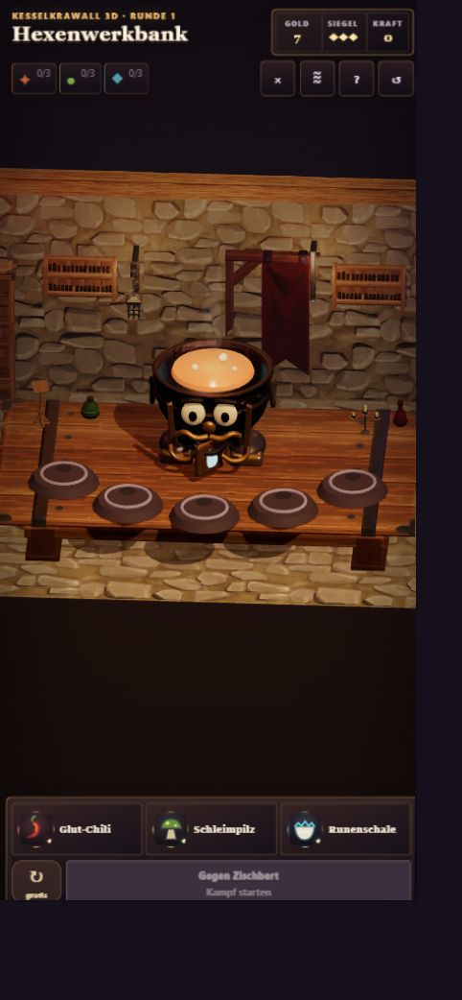

# KesselKrawall 3D

Eigenständiger 3D-Rebuild von **KesselKrawall / Cauldron Rumble** als statisch
deploybares Browsergame mit TypeScript, Vite, React, Three.js und
`@react-three/fiber`.

## Spielen

**[KesselKrawall 3D jetzt im Browser spielen](https://emfau88.github.io/KesselKrawall-3-D/)**

Desktop sowie Mobile Landscape und Portrait werden unterstützt. Das Spiel
läuft vollständig clientseitig und benötigt kein Konto.



<p align="center">
  
  
</p>

## Aktueller Stand

Legacy-Audit, renderer-neutraler Core, spielbarer 3D-Vertical-Slice und der
Blender-/North-Star-Art-Pass sowie Mobile-/UX-Polish sind umgesetzt. Der Lauf
führt vom Drei-Angebote-Shop über Kauf, sichtbaren Merge, Synergieanzeige und
Slot-Tausch in einen deterministisch simulierten 3D-Kampf mit HP, VFX, Ergebnis
und Rückkehr zur Werkbank. Legacy-Presentation-Code und Legacy-Grafikassets
bleiben ausgeschlossen; ausschließlich das separat lizenzierte und vollständig
attribuierte Audiopaket wurde als kuratierter Runtime-Baustein übernommen.

Der aktuelle Golden Slice verwendet eine kuratierte, mobile-optimierte Auswahl
aus Quaternius Fantasy Props, Medieval Village und Stylized Nature als
gemeinsame visuelle Sprache. Spieler und Moor-Martha kombinieren einen
hochwertigen texturierten Donor-Kessel mit originalen modularen Gesichtern,
Regalia, Wurzeln, Moos und dynamischer Flüssigkeit. Die reproduzierbare
Blender-5.2- und Asset-Aufbereitungspipeline liegt unter `art/blender/` und
`scripts/`. Hinzu kommen bewegtes Alchemistenpublikum, Ambient-Magie, klar
getrennte Cast-/Travel-/Impact-Phasen sowie ein Fantasy-UI-Pass mit dunklen
Schmiedepaneelen und Messingkanten.

Der P1-Golden-Encounter gegen Moor-Martha ergänzt eine vollständig eigene
Sumpf-Ritualarena, reaktionsfähige Kesselgesichter, große Zutaten mit echten
Cooldown-Ringen, item-spezifische Flug- und Klangprofile für alle 20 Zutaten,
eine gestufte K.-o.-Inszenierung und eine Ergebnis-Chronik, die Schaden,
Schild, Heilung, Gift und Auslösungen pro Zutat aufschlüsselt.

P2 rollt diesen Standard über die komplette erste Kampagne aus: Alle acht
Gegner besitzen nun charakteristische Kessel-Regalia, Arenamotive,
Farbdramaturgie, Signature-VFX und eigene Audioakzente. Der Shop zeigt echte,
individuelle Zutatenporträts statt Familien-Platzhaltern und verzichtet auf die
doppelte Angebotsdarstellung vor der Werkbank. Deutlich größere Modelle,
Runenringe und Stufensteine unterscheiden Level II und III dauerhaft. Im Kampf
haben Lebensleisten, Uhr, Effektbahn und Cooldowns Vorrang; Ressourcen und
Werkstattsteuerung werden auf Desktop und Mobile konsequent ausgeblendet.

P2.5A ergänzt eine vollständige Game-Shell vor dem eigentlichen Lauf: eine
animierte 3D-Titelszene, Kampagnenwahl, zustandsabhängiges Fortsetzen,
Zutatengrimoire, kompakte Spielanleitung, zentralisierte Audio-/Grafikoptionen
sowie Credits und Asset-Lizenzen. Ein neuer Lauf überschreibt den gespeicherten
Stand erst nach bewusster Kampagnenwahl; aus Werkbank und Ergebnisbildschirmen
führt jederzeit ein klarer Weg zurück ins Hauptmenü. Desktop, Mobile Portrait
und kurzes Landscape besitzen eigene, touchfreundliche Menükompositionen.

Käufe werden als abgeschlossene Präsentationstransaktion gezeigt: Flug,
Landung, jede Stufe einer Merge-Kaskade und erst danach die endgültige
Inventaransicht. Zutaten tragen sichtbare Stufenmarker; ausgewählte Zutaten
zeigen Takt, Wirkung und ihre ausgehenden beziehungsweise empfangenen Buffs
direkt auf der Werkbank. Im Kampf erscheinen gebündelte Schadens-, Heilungs-,
Schild- und Statuseinblendungen am betroffenen Kessel sowie kompakte
Buff-/Debuff-Badges in den Lebensleisten.

Zusätzlich enthalten sind Kampagnenwahl, Reservebedienung, gespeicherter
Shop-Run und Kampagnenfortschritt, Kurzeinführung, lizenzierte Musik,
Kessel-Ambience sowie räumlich gemischte UI-/Kampfsounds, Portrait-/Landscape-
Layouts, Touchsteuerung und ein installierbares Web-App-Manifest. Vor jedem
Kampf lädt ein sichtbares Preparation-Gate die kritischen Modelle und Texturen,
wartet auf den ersten vollständigen Arenaframe und startet erst dann die
deterministische Kampftimeline.

- Neues Arbeitsrepository: dieses Repository
- Nur lesbare Referenz während der Migration: separates lokales
  `KesselKrawall-reference`-Repository
- Auditierter Referenz-Commit: `5c4ec098b36d44d6dde4de31cba422de8b4f2b24`

Die Referenz ist Quelle für Regeln, Content und Balance, nicht für die neue
Presentation-Architektur. Insbesondere werden `Game.tsx`, die alte CSS-Struktur
und die 2D-Sprite-Komposition nicht portiert.

## Dokumentation

- [Legacy-Migrationsaudit](docs/LEGACY_MIGRATION_AUDIT.md)
- [Zielarchitektur](docs/ARCHITECTURE.md)
- [Art Direction](docs/ART_DIRECTION.md)
- [Asset- und Lizenzregister](docs/ASSET_LICENSES.md)
- [Asset-Strategie: Phase-1-Audit und Beschaffungsentscheidung](docs/ASSET_STRATEGY_PHASE_1.md)
- [Asset-Strategie: Phase-2-Bake-off und Golden Slice](docs/ASSET_STRATEGY_PHASE_2.md)
- [Bewusste Verhaltensunterschiede](docs/BEHAVIOR_DIFFERENCES.md)
- [Mobile- und Performance-QA](docs/MOBILE_AND_PERFORMANCE_QA.md)
- [Production-Art-Review](docs/PRODUCTION_ART_REVIEW.md)
- [P1: Moor-Martha Golden Encounter](docs/P1_GOLDEN_ENCOUNTER.md)
- [P2: Golden-Encounter-Rollout des großen Kesselturniers](docs/P2_GRAND_TOURNAMENT_ROLLOUT.md)
- [P2.5A: Hauptmenü und Game-Shell](docs/P2_5_MAIN_MENU_GAME_SHELL.md)
- [Production-Art-Referenzen](docs/reference-art/README.md)

## Lokale Checks

```bash
npm install
npm test
npm run typecheck
npm run build
npm run dev
```

Für einen Test auf einem Smartphone im selben WLAN:

```bash
npm run dev -- --host 0.0.0.0
```

Anschließend die vom Terminal angezeigte Netzwerkadresse auf dem Smartphone
öffnen. Jeder Push auf `master` wird nach erfolgreichen Tests automatisch über
GitHub Pages veröffentlicht.

## Arbeitsphasen

1. Audit und Migrationsgrenzen
2. Renderer-neutralen Core bewusst extrahieren und testen
3. 3D-Greybox für Kamera, Licht, Werkbank und Arena *(umgesetzt)*
4. Shop, Merge, Synergie und deterministischen Kampf anbinden *(umgesetzt)*
5. Visuellen Vertical Slice mit Production-Art und Kampf-VFX ausarbeiten *(umgesetzt)*
6. Audio, Onboarding und Reaktionsqualität *(umgesetzt; echter Musik-/SFX-Mix)*
7. Responsive- und Performance-QA *(umgesetzt; Battle-Readiness-Gate und mobile Qualitätsstufe, physischer Gerätesmoketest empfohlen)*
8. Hauptmenü und Game-Shell *(P2.5A umgesetzt; Save-aware Fortsetzen, Grimoire, Anleitung, Einstellungen und Credits)*

Jede Phase muss ihren eigenen Quality Gate bestehen, bevor die nächste beginnt.
