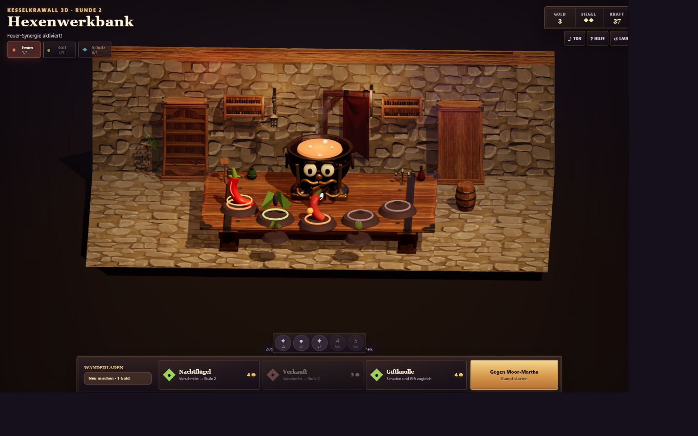
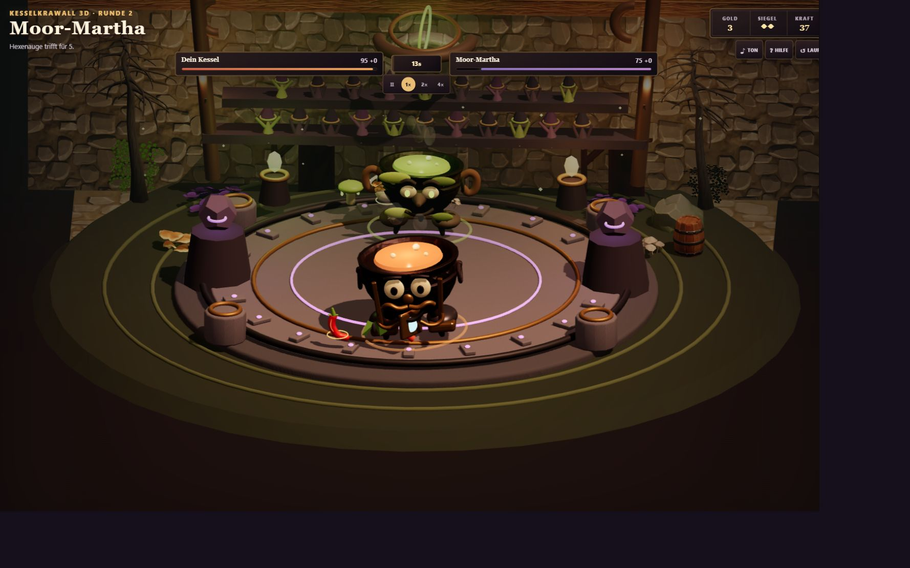
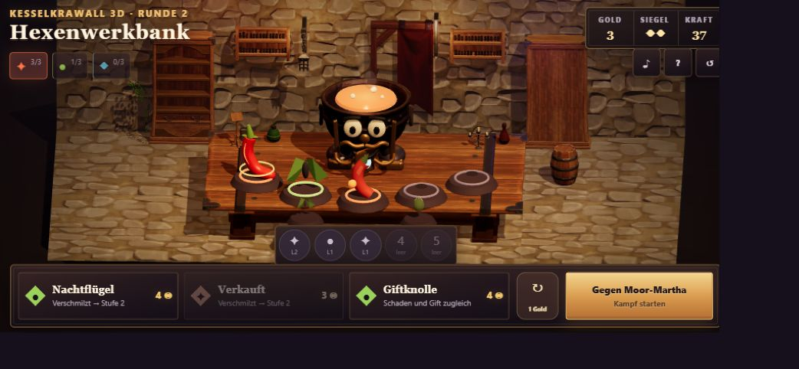

# KesselKrawall 3D

Eigenständiger 3D-Rebuild von **KesselKrawall / Cauldron Rumble** als statisch
deploybares Browsergame mit TypeScript, Vite, React, Three.js und
`@react-three/fiber`.

## Spielen

**[KesselKrawall 3D jetzt im Browser spielen](https://emfau88.github.io/KesselKrawall-3-D/)**

Desktop sowie Mobile Landscape und Portrait werden unterstützt. Das Spiel
läuft vollständig clientseitig und benötigt kein Konto.



<p align="center">
  
  
</p>

## Aktueller Stand

Legacy-Audit, renderer-neutraler Core, spielbarer 3D-Vertical-Slice und der
Blender-/North-Star-Art-Pass sowie Mobile-/UX-Polish sind umgesetzt. Der Lauf
führt vom Drei-Angebote-Shop über Kauf, sichtbaren Merge, Synergieanzeige und
Slot-Tausch in einen deterministisch simulierten 3D-Kampf mit HP, VFX, Ergebnis
und Rückkehr zur Werkbank. Kein Legacy-Presentation-Code und kein
Legacy-Runtime-Asset wurde übernommen.

Der aktuelle Golden Slice verwendet eine kuratierte, mobile-optimierte Auswahl
aus Quaternius Fantasy Props, Medieval Village und Stylized Nature als
gemeinsame visuelle Sprache. Spieler und Moor-Martha kombinieren einen
hochwertigen texturierten Donor-Kessel mit originalen modularen Gesichtern,
Regalia, Wurzeln, Moos und dynamischer Flüssigkeit. Die reproduzierbare
Blender-5.2- und Asset-Aufbereitungspipeline liegt unter `art/blender/` und
`scripts/`. Hinzu kommen bewegtes Alchemistenpublikum, Ambient-Magie, klar
getrennte Cast-/Travel-/Impact-Phasen sowie ein Fantasy-UI-Pass mit dunklen
Schmiedepaneelen und Messingkanten.

Zusätzlich enthalten sind Kampagnenwahl, Reservebedienung, gespeicherter
Shop-Run und Kampagnenfortschritt, Kurzeinführung, synthetisierte Web-Audio-SFX,
Portrait-/Landscape-Layouts, Touchsteuerung und ein installierbares Web-App-
Manifest.

- Neues Arbeitsrepository: dieses Repository
- Nur lesbare Referenz während der Migration: separates lokales
  `KesselKrawall-reference`-Repository
- Auditierter Referenz-Commit: `5c4ec098b36d44d6dde4de31cba422de8b4f2b24`

Die Referenz ist Quelle für Regeln, Content und Balance, nicht für die neue
Presentation-Architektur. Insbesondere werden `Game.tsx`, die alte CSS-Struktur
und die 2D-Sprite-Komposition nicht portiert.

## Dokumentation

- [Legacy-Migrationsaudit](docs/LEGACY_MIGRATION_AUDIT.md)
- [Zielarchitektur](docs/ARCHITECTURE.md)
- [Art Direction](docs/ART_DIRECTION.md)
- [Asset- und Lizenzregister](docs/ASSET_LICENSES.md)
- [Asset-Strategie: Phase-1-Audit und Beschaffungsentscheidung](docs/ASSET_STRATEGY_PHASE_1.md)
- [Asset-Strategie: Phase-2-Bake-off und Golden Slice](docs/ASSET_STRATEGY_PHASE_2.md)
- [Bewusste Verhaltensunterschiede](docs/BEHAVIOR_DIFFERENCES.md)
- [Mobile- und Performance-QA](docs/MOBILE_AND_PERFORMANCE_QA.md)
- [Production-Art-Review](docs/PRODUCTION_ART_REVIEW.md)
- [Production-Art-Referenzen](docs/reference-art/README.md)

## Lokale Checks

```bash
npm install
npm test
npm run typecheck
npm run build
npm run dev
```

Für einen Test auf einem Smartphone im selben WLAN:

```bash
npm run dev -- --host 0.0.0.0
```

Anschließend die vom Terminal angezeigte Netzwerkadresse auf dem Smartphone
öffnen. Jeder Push auf `master` wird nach erfolgreichen Tests automatisch über
GitHub Pages veröffentlicht.

## Arbeitsphasen

1. Audit und Migrationsgrenzen
2. Renderer-neutralen Core bewusst extrahieren und testen
3. 3D-Greybox für Kamera, Licht, Werkbank und Arena *(umgesetzt)*
4. Shop, Merge, Synergie und deterministischen Kampf anbinden *(umgesetzt)*
5. Visuellen Vertical Slice mit Production-Art und Kampf-VFX ausarbeiten *(umgesetzt)*
6. Audio, Onboarding und Reaktionsqualität *(umgesetzt)*
7. Responsive- und Performance-QA *(umgesetzt; physischer Gerätesmoketest empfohlen)*

Jede Phase muss ihren eigenen Quality Gate bestehen, bevor die nächste beginnt.
